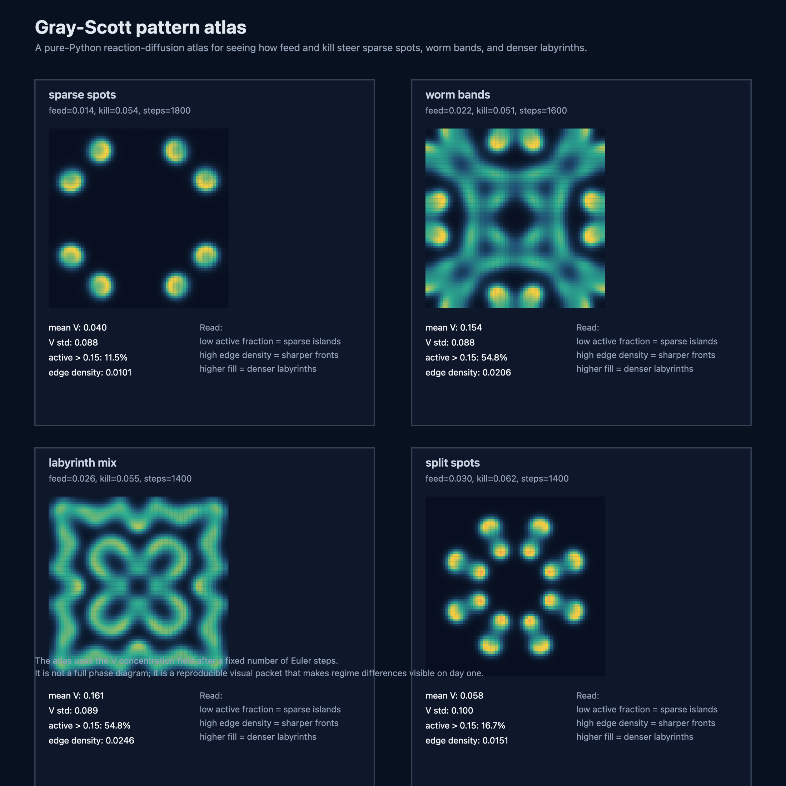
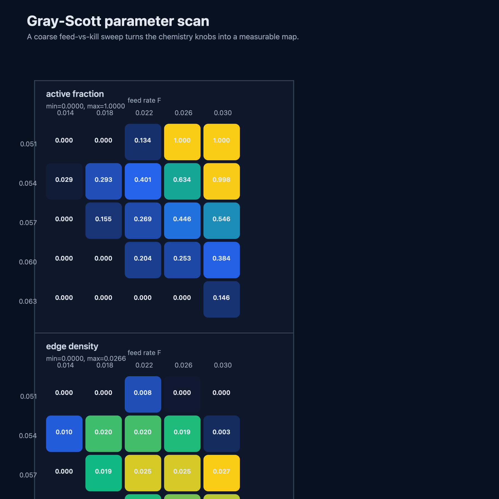
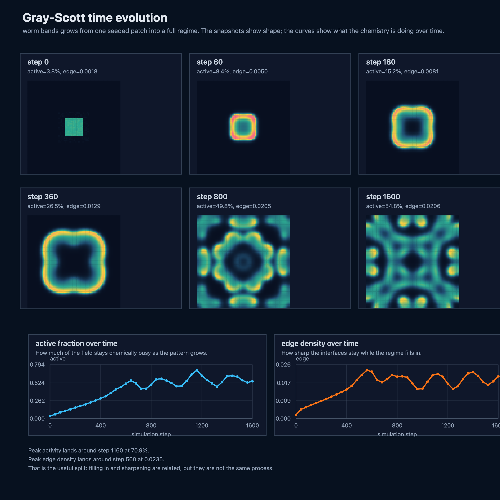
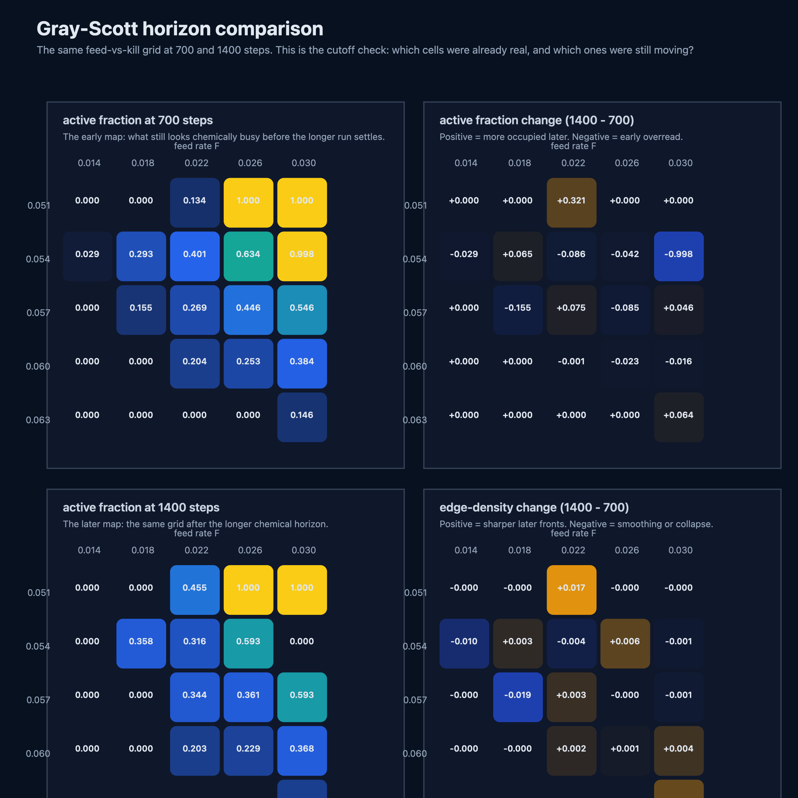
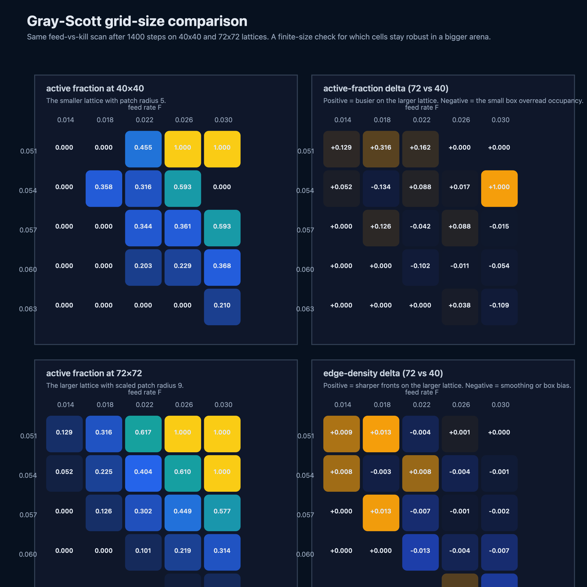
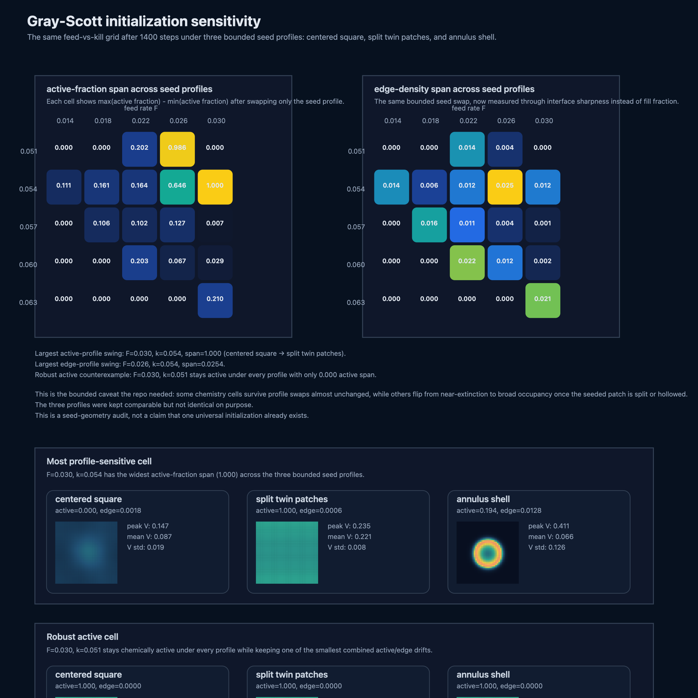

# Gray-Scott Lab

A compact reaction-diffusion lab for the Gray-Scott model.

The point is simple: turn the feed and kill knobs into something you can see and measure instead of treating pattern names like folklore.

## Model

The simulator evolves the standard two-species Gray-Scott system on a periodic square grid:

```text
u[t+1] = u[t] + D_u ∇²u - u v² + F (1 - u)
v[t+1] = v[t] + D_v ∇²v + u v² - (F + k) v
```

This repo starts with a fixed seeded perturbation and then asks two day-one questions:

- what visibly different regimes show up for a few curated `(F, k)` pairs?
- what changes on a coarse feed-vs-kill scan if you measure active fraction and edge density instead of only eyeballing the field?

## What is here

- `gray_scott_lab/core.py`: deterministic seeding, explicit Euler updates, simulation helpers, and sampled trajectory capture for time-evolution studies
- `gray_scott_lab/analysis.py`: curated presets, pattern metrics for activity and interface sharpness, a time-evolution study for the worm-band lane, a short-vs-long horizon comparison for the coarse parameter grid, a larger-lattice comparison that separates finite-size drift from the earlier time-horizon story, and now a seed-profile sensitivity pass that checks how much of the same grid still depends on the seeded patch geometry
- `gray_scott_lab/render.py`: SVG atlas, parameter-map, time-evolution, horizon-comparison, grid-size-comparison, and initialization-sensitivity renderers plus PNG export
- `gray_scott_lab/cli.py`: one-shot summaries plus atlas, metric-map, time-evolution, horizon-comparison, grid-size-comparison, and initialization-sensitivity rendering commands
- `scripts/generate_gallery.py`: rebuild the public artifacts, CSV sidecars, reports, and notebooks in one pass
- `reports/pattern-atlas-and-parameter-scan.md`, `reports/time-evolution-sidecar.md`, `reports/horizon-comparison-sidecar.md`, `reports/grid-size-comparison-sidecar.md`, and `reports/initialization-sensitivity-sidecar.md`: technical sidecars for reading the regimes as final states, growth processes, horizon-sensitive scans, finite-size-sensitive scans, and now seed-geometry-sensitive scans
- `notebooks/gray_scott_regimes.ipynb`, `notebooks/gray_scott_time_evolution.ipynb`, `notebooks/gray_scott_horizon_comparison.ipynb`, `notebooks/gray_scott_grid_size_comparison.ipynb`, and `notebooks/gray_scott_initialization_sensitivity.ipynb`: slower companions with equations, code, and interpretation
- `tests/test_core.py`: small checks for determinism, bounds, regime separation, time-evolution sampling, horizon-comparison drift, grid-size sensitivity, and the new initialization-sensitivity pass

## Generated artifacts

### Pattern atlas



### Coarse parameter scan



### Time evolution sidecar



### Horizon comparison sidecar



### Grid-size comparison sidecar



### Initialization-sensitivity sidecar



## Run it

```bash
python3 scripts/generate_gallery.py
python3 -m unittest discover -s tests
```

Get a quick metric summary for one pair:

```bash
python3 -m gray_scott_lab.cli summarize --feed 0.022 --kill 0.051
```

Render the atlas alone:

```bash
python3 -m gray_scott_lab.cli render-atlas --output art/gray-scott-pattern-atlas.svg --png-output art/gray-scott-pattern-atlas.png
```

Render the coarse parameter scan alone:

```bash
python3 -m gray_scott_lab.cli render-metric-map --output art/gray-scott-parameter-map.svg --png-output art/gray-scott-parameter-map.png
```

Render the time-evolution sidecar for the curated worm-band preset:

```bash
python3 -m gray_scott_lab.cli render-timeline --output art/gray-scott-time-evolution.svg --png-output art/gray-scott-time-evolution.png
```

Render the short-vs-long horizon comparison for the coarse scan:

```bash
python3 -m gray_scott_lab.cli render-horizon-comparison --output art/gray-scott-horizon-comparison.svg --png-output art/gray-scott-horizon-comparison.png
```

Render the smaller-vs-larger lattice comparison for the same coarse scan:

```bash
python3 -m gray_scott_lab.cli render-grid-size-comparison --output art/gray-scott-grid-size-comparison.svg --png-output art/gray-scott-grid-size-comparison.png
```

Render the seed-profile sensitivity comparison for the same coarse scan:

```bash
python3 -m gray_scott_lab.cli render-initialization-sensitivity --output art/gray-scott-initialization-sensitivity.svg --png-output art/gray-scott-initialization-sensitivity.png
```

## Why this repo is interesting

Most introductions stop at pretty pictures. This one starts building a reusable measurement lane:

- the atlas gives four reproducible regimes with fixed initialization and step counts
- the parameter scan turns the chemistry knobs into an experiment instead of a list of screenshot captions
- the time-evolution sidecar shows one regime as a growth process instead of only a final frame
- the horizon-comparison sidecar checks whether the coarse scan had already settled or was still moving under a longer run
- the grid-size comparison sidecar checks which longer-run cells stay stable on a larger lattice and which ones were still being steered by the small box
- the new initialization-sensitivity sidecar checks which cells survive bounded seed-profile swaps and which ones still flip when the same initial disturbance is concentrated, split, or hollowed
- the CSV, reports, notebooks, and tests make it easier to deepen into a real regime study later

## Good next moves

- add one compact settled/growing/fading tag only if it sharpens the story instead of pretending to be a universal classifier
- repeat the new seed-profile swap on one larger lattice only if that changes the sensitivity map instead of redrawing it
- extend the chemistry lane with one second reaction-diffusion model only if it reveals a genuinely different pattern family instead of duplicating the same feed/kill story
